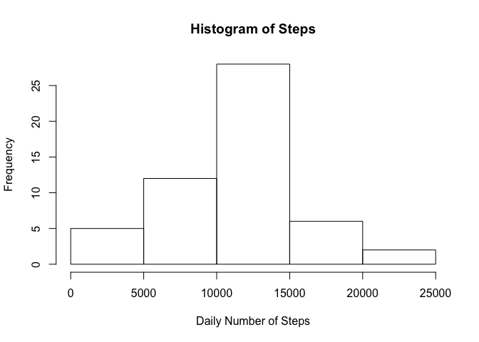
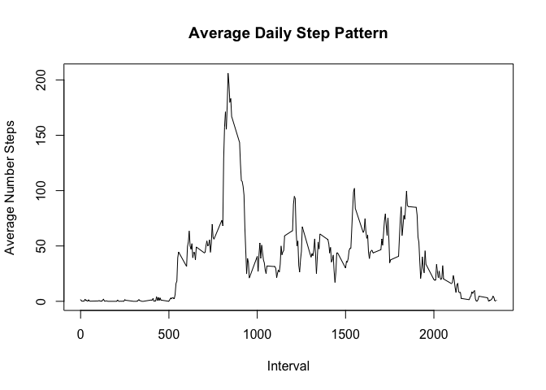
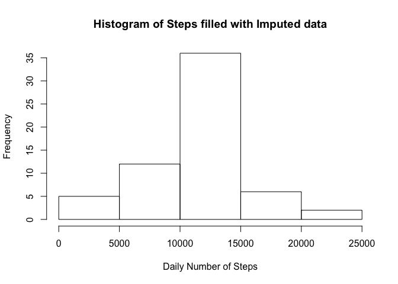
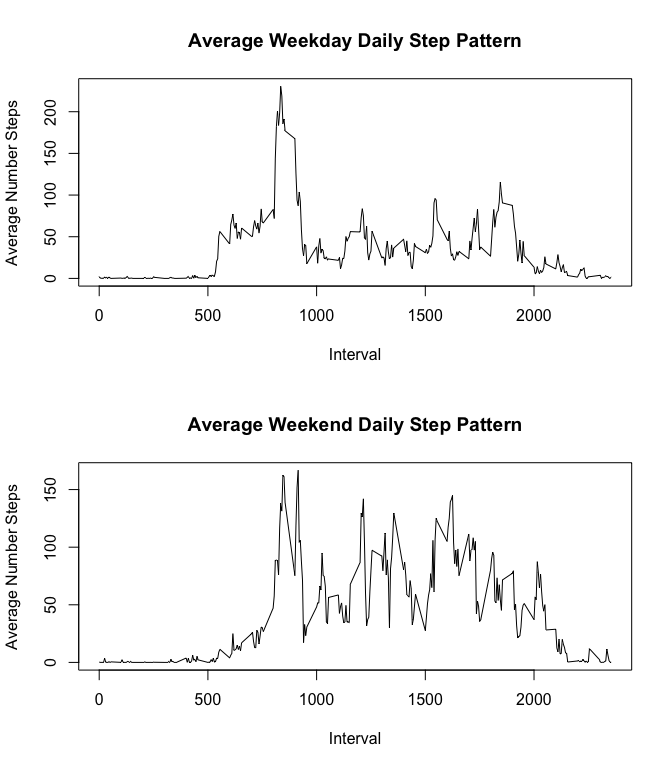

# Reproducible Research: Peer Assessment 1
This example shows how to utilize a R markdown document to import a dataset, process, and produce some simple graphics.  The dataset is from the Sep 2015 Reproducable Research class and is based upon activity data.  

## Loading and preprocessing the data

First we need to load the data and process it. Along with a quick summary of the dataset.


```r
library(dplyr)
```

```
## 
## Attaching package: 'dplyr'
## 
## The following object is masked from 'package:stats':
## 
##     filter
## 
## The following objects are masked from 'package:base':
## 
##     intersect, setdiff, setequal, union
```

```r
data <- read.csv('activity.csv')
summary(data)
```

```
##      steps                date          interval     
##  Min.   :  0.00   2012-10-01:  288   Min.   :   0.0  
##  1st Qu.:  0.00   2012-10-02:  288   1st Qu.: 588.8  
##  Median :  0.00   2012-10-03:  288   Median :1177.5  
##  Mean   : 37.38   2012-10-04:  288   Mean   :1177.5  
##  3rd Qu.: 12.00   2012-10-05:  288   3rd Qu.:1766.2  
##  Max.   :806.00   2012-10-06:  288   Max.   :2355.0  
##  NA's   :2304     (Other)   :15840
```

## What is mean total number of steps taken per day?

In this protion of the analysis we are going to do three simple tasks.  Namely,

1. Calculate the total number of steps per day
2. Make a histogram of the number of steps per day
3. Calculate and report the mean and median of steps taken per day

### Calculate steps per day
To complete this portion of the analysis we will utilize the dplyr package. We use the group_by
capability to break the date column up into the seperate days and then utilize the summarise capability to compute the total number of steps per day.  A short summary of the processed data set is presented.


```r
dailySteps <- data %>% group_by(date) %>% summarise(NumSteps=sum(steps))
summary(dailySteps)
```

```
##          date       NumSteps    
##  2012-10-01: 1   Min.   :   41  
##  2012-10-02: 1   1st Qu.: 8841  
##  2012-10-03: 1   Median :10765  
##  2012-10-04: 1   Mean   :10766  
##  2012-10-05: 1   3rd Qu.:13294  
##  2012-10-06: 1   Max.   :21194  
##  (Other)   :55   NA's   :8
```

### Make histogram
Making the histogram is straightforward with the hist function.  

```r
hist(dailySteps$NumSteps,xlab='Daily Number of Steps',main='Histogram of Steps')
```

 

### Mean and median steps
Now we can compute the mean and median of daily step data using the standard r functions.  Note, we need to ignore the missing values in this computation.


```r
dailyMean <- mean(dailySteps$NumSteps,na.rm=TRUE)
dailyMedian <- median(dailySteps$NumSteps,na.rm=TRUE)
```

The mean of 1.0766189\times 10^{4} is quite close to the median value of 10765

## What is the average daily activity pattern?
Now we want to pull together a picture of the typical variation of number of steps taken throughout a day.  In R the easiest way to accomplish this to break the day down by the intervals and then compute an average value across all the days ignore NA values.  A plot of this pattern shows the variation of actvity throughout the day.


```r
averageDay <- data %>% 
  group_by(interval) %>% 
  summarise(mean = mean(steps,na.rm=TRUE))

plot(averageDay$interval,averageDay$mean,type='l',
       xlab='Interval',ylab='Average Number Steps',
       main='Average Daily Step Pattern')
```

 

```r
maxSteps <- max(averageDay$mean)
intmax <- averageDay$interval[which.max(averageDay$mean)]
```

The maximum number of steps during the average day is 206.1698113 and occurs at interval 835 during the day.

## Imputing missing values

Up to now we have been ignoring the missing data in a relatively crude way.  Now we are going to develop a methodolgy for filling in the missing data. Our approach is going to be fill in the missing data with information from the average day profile we developed in the previous seciton.  

Frist we need to determine extent of the problem.  


```r
missingLocations <- is.na(data$steps)
numMissing <- sum(missingLocations)
percentMissing <- numMissing/length(data$steps)*100.0
```

The number of missing steps is 2304 or roughly 13.1147541 percent of the data.  

The trick for using the average day profile to fill in the missing data is to develop an alogrithm for converting the interval data into an index.  Looking at the we see that first two digits are the hour and the last two are the 5 minute interval


```r
data$interval[25:45]
```

```
##  [1] 200 205 210 215 220 225 230 235 240 245 250 255 300 305 310 315 320
## [18] 325 330 335 340
```

So with some simple math it is possible to convert the tiem information index, as you can see from this exampe


```r
(floor(data$interval[25:45]/100)*12 + (data$interval[25:45] %% 100)/5)+1
```

```
##  [1] 25 26 27 28 29 30 31 32 33 34 35 36 37 38 39 40 41 42 43 44 45
```

Note the need of the plus 1 to the index conversion since R starts the indices at 1.

Now missingLocations data can be used fill in missing values and add that data to the dataframe so we can use it for further analysis.


```r
imputedData <- data$steps
intVal <- floor(data$interval[missingLocations]/100)*12 + 
  (data$interval[missingLocations] %% 100)/5+1
imputedData[missingLocations] <- averageDay$mean[intVal]
numMissing <- sum(is.na(imputedData))
data$imputed <- imputedData
```

The number of missing values is now .  Now we can compare the distribution of steps, mean, and median of the imputed data with the original data with missing values.


```r
imputedDailySteps <- data %>% group_by(date) %>% 
  summarise(NumSteps=sum(imputed))
hist(imputedDailySteps$NumSteps,
     xlab='Daily Number of Steps',
     main='Histogram of Steps filled with Imputed data')
```

 

```r
imputedMean <- mean(imputedDailySteps$NumSteps)
imputedMedian <- median(imputedDailySteps$NumSteps)
```

As the histogram shows the frequency of steps is affected by the filled in data, but since we filled in with average day information mean of the imputed data 1.0766189\times 10^{4} remains the nearly same as the original 1.0766189\times 10^{4}.  Filling in the missing data with daily average brings makes the imputed median value of 1.0766189\times 10^{4} is the same as mean which and slightly lower than the median value of 10765 obtain from the data without filling in the missing information.

## Are there differences in activity patterns between weekdays and weekends?

In order to compare weekdays and weekends we need to first create a varible to seperate the day types.  This starts by using the weekdays function to get the name of the day.  Then we create the dayType array filled with 'Weekday'. Then we use the grep function to find the location of Saturday and Sunday in the dayName array and replace those locations with the 'Weekend' value in the dayType array.  We add this information to the data dataframe.


```r
posixDate <- strptime(data$date,"%Y-%m-%d")
dayName <- weekdays(posixDate)
dayType <- replicate(length(data$date),'Weekday')
dayType[grep('Saturday',dayName)] <- 'Weekend'
dayType[grep('Sunday',dayName)] <- 'Weekend'
data$dayType <- dayType
```

Now that we have the day type we can create the average Weekday and Weekend and plot them up.


```r
averageWeekday <- data %>% 
  filter(dayType == 'Weekday') %>% 
  group_by(interval) %>% 
  summarise(mean = mean(imputed))
averageWeekend <- data %>% 
  filter(dayType == 'Weekend') %>% 
  group_by(interval) %>% 
  summarise(mean = mean(imputed))
par(mfrow=c(2,1))
plot(averageWeekday$interval,averageWeekday$mean,type='l',
      xlab='Interval',ylab='Average Number Steps',
      main='Average Weekday Daily Step Pattern')
plot(averageWeekend$interval,averageWeekend$mean,type='l',
      xlab='Interval',ylab='Average Number Steps',
      main='Average Weekend Daily Step Pattern')
```

 

And we clearly see that there is more activity throughout the day on the weekend while during weekdays we are stuck at our deskjobs!


